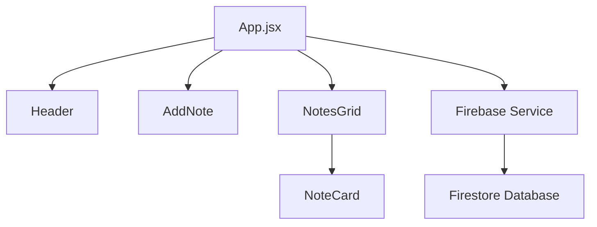

<div align="center">

# 📝 React Notes App

### A modern, cloud-powered note-taking application


[](http://localhost:3000)
[](LICENSE)

---

### 🖼️ Application Preview


</div>

---

## 📋 Table of Contents

- [✨ Features](#-features)
- [🚀 Demo](#-demo)
- [🛠️ Tech Stack](#️-tech-stack)
- [⚡ Quick Start](#-quick-start)
- [🔧 Installation](#-installation)
- [🔥 Firebase Setup](#-firebase-setup)
- [📁 Project Structure](#-project-structure)
- [🎨 UI Components](#-ui-components)
- [🔒 Security](#-security)
- [📱 Responsive Design](#-responsive-design)
- [🐛 Troubleshooting](#-troubleshooting)
- [🤝 Contributing](#-contributing)
- [📄 License](#-license)

---

## ✨ Features

<table>
<tr>
<td>

**📝 Core Features**
- Create, read, and delete notes
- Real-time search functionality
- Cloud storage with Firebase Firestore
- Offline-first with localStorage fallback

</td>
<td>

**🎨 User Experience**
- Modern, responsive design
- Smooth animations and transitions
- Optimistic UI updates
- Cross-device synchronization

</td>
</tr>
</table>

### 🎯 Key Highlights

- **⚡ Fast Performance**: Optimistic updates for instant feedback
- **🔄 Real-time Sync**: Changes sync across all your devices
- **📱 Mobile Ready**: Fully responsive design for all screen sizes
- **🛡️ Reliable**: Automatic fallback to local storage
- **🎨 Beautiful UI**: Modern gradient design with smooth animations

---

## 🚀 Demo

🌐 **Live Application**: [http://localhost:3000](http://localhost:3000)

> **Note**: Make sure to complete the Firebase setup to enable cloud storage features.

---

## 🛠️ Tech Stack

<div align="center">

| Frontend | Backend | Database | Tools |
|----------|---------|----------|-------|
|  |  |  |  |
|  |  |  |  |
|  | - | - |  |

</div>

### 🔧 Dependencies

```json
{
  "react": "^18.2.0",
  "react-dom": "^18.2.0",
  "firebase": "^10.0.0",
  "react-scripts": "5.0.1"
}
```

---

## ⚡ Quick Start

```bash
# 1️⃣ Clone the repository
git clone https://github.com/ChamathLahiru-CL/notes-app.git

# 2️⃣ Navigate to project directory
cd notes-app

# 3️⃣ Install dependencies
npm install

# 4️⃣ Set up environment variables
cp .env.example .env
# Edit .env with your Firebase config

# 5️⃣ Start development server
npm start
```

🎉 **That's it!** Your app will open at `http://localhost:3000`

---

## 🔧 Installation

### Prerequisites

- **Node.js** (v14 or higher)
- **npm** or **yarn**
- **Firebase Project** (for cloud storage)

### Step-by-Step Setup

1. **Clone the Repository**
   ```bash
   git clone https://github.com/ChamathLahiru-CL/notes-app.git
   cd notes-app
   ```

2. **Install Dependencies**
   ```bash
   npm install
   ```

3. **Environment Configuration**
   ```bash
   # Create environment file
   cp .env.example .env
   
   # Edit with your Firebase credentials
   nano .env
   ```

4. **Start Development Server**
   ```bash
   npm start
   ```

---

## � Firebase Setup

<details>
<summary><strong>📚 Complete Firebase Configuration Guide</strong></summary>

### 1. Create Firebase Project

1. 🌐 Visit [Firebase Console](https://console.firebase.google.com/)
2. ➕ Click **"Create a project"**
3. 📝 Enter project name: `notes-app` (or your preference)
4. 📊 Enable/disable Google Analytics as needed
5. ✅ Click **"Create project"**

### 2. Setup Firestore Database

1. 🗄️ Navigate to **"Firestore Database"**
2. 🆕 Click **"Create database"**
3. 🔐 Choose security mode:
   - **🧪 Test mode**: Open access for 30 days (development)
   - **🔒 Production mode**: Secure access (requires authentication)
4. 🌍 Select database location (closest to your users)

### 3. Web App Registration

1. 🏠 Go to **Project Overview**
2. 🌐 Click the **web icon** (`</>`)
3. 📱 Register app with nickname: `notes-web-app`
4. 📋 Copy the `firebaseConfig` object

### 4. Environment Configuration

Create your `.env` file with Firebase credentials:

```env
# 🔥 Firebase Configuration
REACT_APP_FIREBASE_API_KEY=your-actual-api-key
REACT_APP_FIREBASE_AUTH_DOMAIN=your-project.firebaseapp.com
REACT_APP_FIREBASE_PROJECT_ID=your-actual-project-id
REACT_APP_FIREBASE_STORAGE_BUCKET=your-project.appspot.com
REACT_APP_FIREBASE_MESSAGING_SENDER_ID=your-actual-sender-id
REACT_APP_FIREBASE_APP_ID=your-actual-app-id
```

### 5. Security Rules (Development)

```javascript
rules_version = '2';
service cloud.firestore {
  match /databases/{database}/documents {
    match /notes/{noteId} {
      allow read, write: if true; // ⚠️ Development only
    }
  }
}
```

</details>

---

## 📁 Project Structure

```
📦 notes-app
├── 📁 public/
│   ├── 🌐 index.html              # HTML template
│   └── 📄 manifest.json           # PWA manifest
├── 📁 src/
│   ├── 📱 App.jsx                 # Main application component
│   ├── 🎨 App.css                 # Application styles
│   ├── 🔥 firebase.js             # Firebase configuration
│   ├── ⚙️ firebaseService.js      # Firestore CRUD operations
│   ├── 🚀 index.js                # React entry point
│   └── 🎨 index.css               # Global styles
├── 📄 package.json                # Dependencies & scripts
├── 🔐 .env                        # Environment variables
├── 📚 README.md                   # Project documentation
└── 🚫 .gitignore                  # Git ignore rules
```

### 🧩 Component Architecture



---

## 🎨 UI Components

### 📝 Note Card Component
- **Title**: Bold heading for easy identification
- **Content**: Rich text content with line breaks
- **Date**: Automatic timestamp
- **Actions**: Delete button with confirmation

### 🔍 Search Component
- **Real-time filtering**: Search by title or content
- **Responsive design**: Works on all screen sizes
- **Clear results**: Visual feedback for search results

### ➕ Add Note Component
- **Title input**: Required field validation
- **Content textarea**: Multi-line text support
- **Submit button**: Disabled state management
- **Keyboard shortcuts**: Enter to submit

---

## 🔒 Security

### 🛡️ Security Best Practices

| Component | Security Measure | Status |
|-----------|------------------|---------|
| **Environment Variables** | Sensitive data in `.env` | ✅ Implemented |
| **Git Security** | `.env` in `.gitignore` | ✅ Protected |
| **Firebase Rules** | Firestore security rules | ⚠️ Development mode |
| **Input Validation** | Client-side validation | ✅ Implemented |

### 🔐 Production Security Checklist

- [ ] Implement user authentication
- [ ] Update Firestore security rules
- [ ] Add input sanitization
- [ ] Enable HTTPS only
- [ ] Set up error monitoring

---

## 📱 Responsive Design

### 📊 Breakpoints

| Device | Breakpoint | Layout |
|--------|------------|---------|
| 📱 Mobile | `< 768px` | Single column |
| 📱 Tablet | `768px - 1024px` | Two columns |
| 🖥️ Desktop | `> 1024px` | Three+ columns |

### 🎨 Design Features

- **Fluid Grid**: CSS Grid with auto-fit columns
- **Flexible Images**: Responsive image scaling
- **Touch-Friendly**: Large tap targets (44px minimum)
- **Accessibility**: WCAG 2.1 AA compliance

---

## 🐛 Troubleshooting

<details>
<summary><strong>🔧 Common Issues & Solutions</strong></summary>

### 🔥 Firebase Connection Issues

| Issue | Symptoms | Solution |
|-------|----------|----------|
| **Invalid API Key** | `Firebase: Error (auth/invalid-api-key)` | ✅ Verify API key in `.env` file |
| **Project Not Found** | `Firebase: Error (auth/project-not-found)` | ✅ Check project ID spelling |
| **Permission Denied** | `Missing or insufficient permissions` | ✅ Update Firestore security rules |
| **Network Error** | `Failed to load resource` | ✅ Check internet connection |

### 🚀 App Loading Issues

| Issue | Symptoms | Solution |
|-------|----------|----------|
| **Blank Page** | White screen on load | ✅ Check browser console for errors |
| **Module Not Found** | `Cannot resolve module` | ✅ Run `npm install` |
| **Port In Use** | `Port 3000 is already in use` | ✅ Use `npm start -- --port 3001` |
| **Build Fails** | Compilation errors | ✅ Check syntax and imports |

### 🔍 Debug Commands

```bash
# Check dependencies
npm list

# Clear cache and reinstall
rm -rf node_modules package-lock.json
npm install

# Run with verbose logging
DEBUG=* npm start

# Check Firebase connectivity
npm run test:firebase
```

</details>

---

## 🤝 Contributing

We welcome contributions! Here's how you can help:

### 🚀 Getting Started

1. **🍴 Fork the repository**
   ```bash
   # Click "Fork" on GitHub
   ```

2. **📥 Clone your fork**
   ```bash
   git clone https://github.com/YOUR_USERNAME/notes-app.git
   cd notes-app
   ```

3. **🌿 Create a feature branch**
   ```bash
   git checkout -b feature/amazing-feature
   ```

4. **💻 Make your changes**
   ```bash
   # Write your code
   # Add tests if applicable
   ```

5. **✅ Test your changes**
   ```bash
   npm test
   npm run build
   ```

6. **📤 Commit and push**
   ```bash
   git add .
   git commit -m "Add amazing feature"
   git push origin feature/amazing-feature
   ```

7. **🔄 Create Pull Request**
   - Go to your fork on GitHub
   - Click "New Pull Request"
   - Fill out the template

### � Contribution Guidelines

- **Code Style**: Follow existing code formatting
- **Commits**: Use conventional commit messages
- **Tests**: Add tests for new features
- **Documentation**: Update README if needed

### 🏷️ Issue Labels

| Label | Description |
|-------|-------------|
| 🐛 `bug` | Something isn't working |
| ✨ `enhancement` | New feature or request |
| 📚 `documentation` | Improvements to docs |
| 🎨 `ui/ux` | User interface changes |

---

## �📄 License

<div align="center">

```
MIT License

Copyright (c) 2025 ChamathLahiru-CL

Permission is hereby granted, free of charge, to any person obtaining a copy
of this software and associated documentation files (the "Software"), to deal
in the Software without restriction, including without limitation the rights
to use, copy, modify, merge, publish, distribute, sublicense, and/or sell
copies of the Software, and to permit persons to whom the Software is
furnished to do so, subject to the following conditions:

The above copyright notice and this permission notice shall be included in all
copies or substantial portions of the Software.

THE SOFTWARE IS PROVIDED "AS IS", WITHOUT WARRANTY OF ANY KIND, EXPRESS OR
IMPLIED, INCLUDING BUT NOT LIMITED TO THE WARRANTIES OF MERCHANTABILITY,
FITNESS FOR A PARTICULAR PURPOSE AND NONINFRINGEMENT. IN NO EVENT SHALL THE
AUTHORS OR COPYRIGHT HOLDERS BE LIABLE FOR ANY CLAIM, DAMAGES OR OTHER
LIABILITY, WHETHER IN AN ACTION OF CONTRACT, TORT OR OTHERWISE, ARISING FROM,
OUT OF OR IN CONNECTION WITH THE SOFTWARE OR THE USE OR OTHER DEALINGS IN THE
SOFTWARE.
```

</div>

---

<div align="center">

### 🙋‍♂️ Questions or Need Help?

[](https://github.com/ChamathLahiru-CL/notes-app/issues)
[](mailto:your.email@example.com)

**Made with ❤️ by [ChamathLahiru-CL](https://github.com/ChamathLahiru-CL)**

⭐ **Found this helpful? Give it a star!** ⭐

</div>
